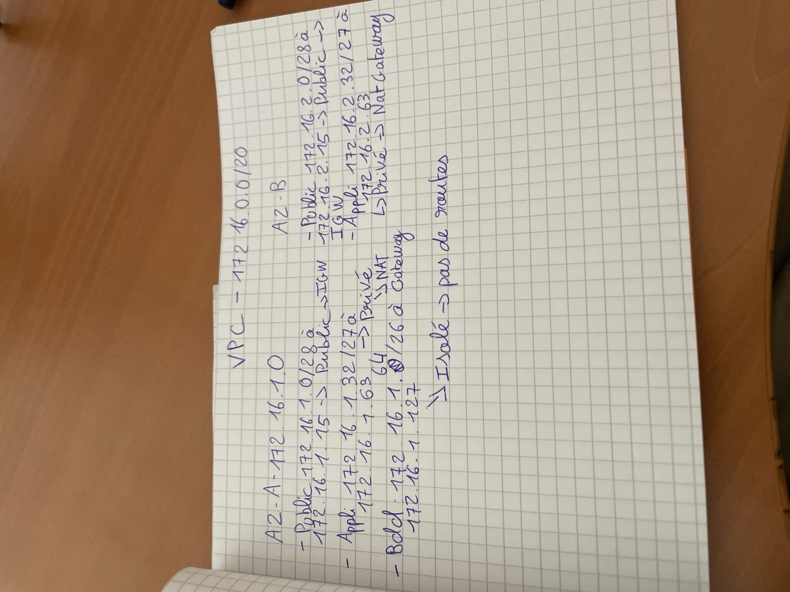
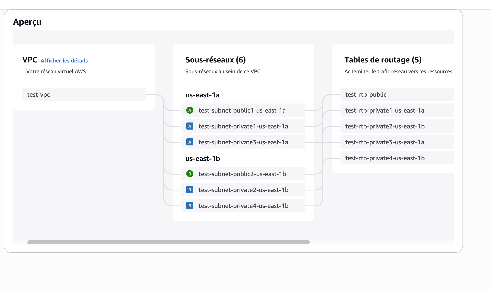
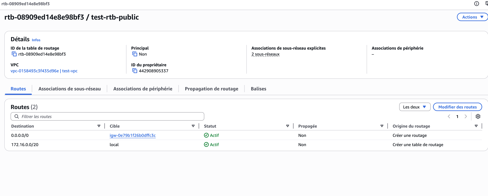
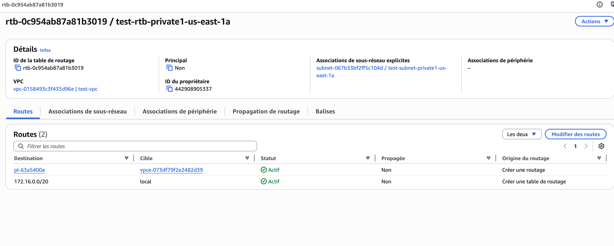
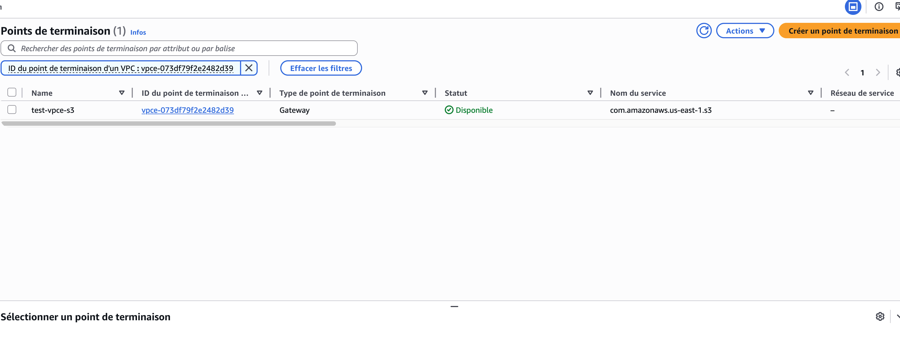
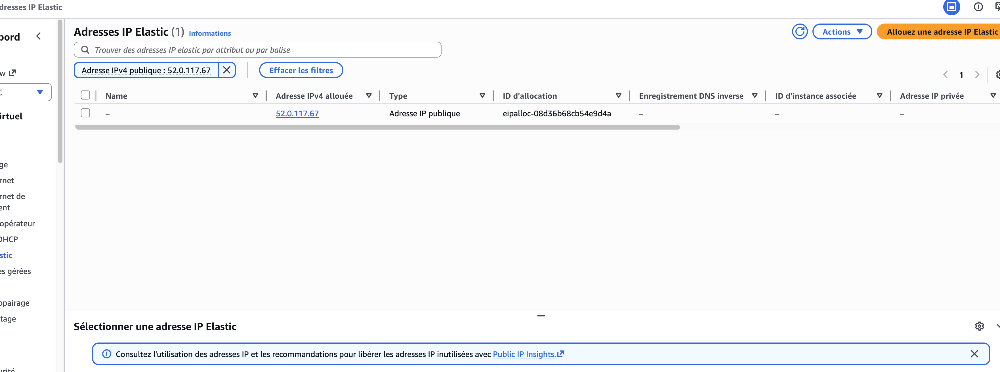
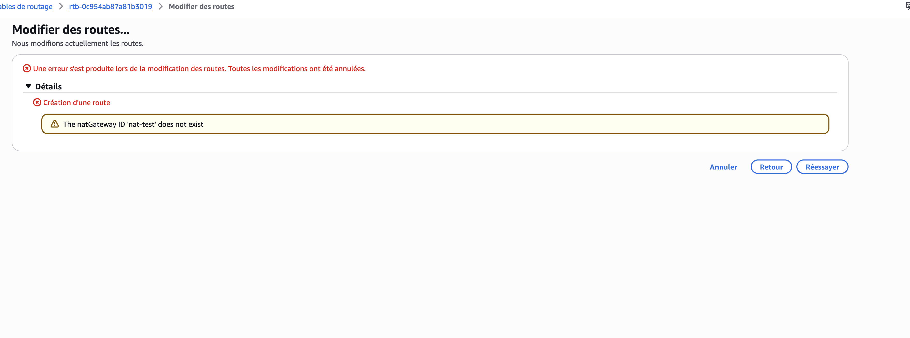
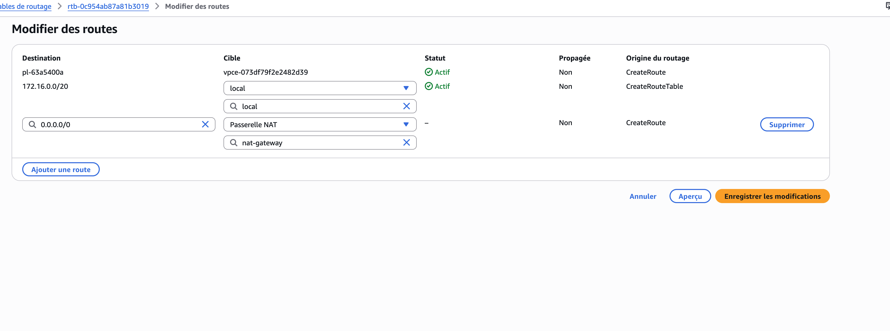
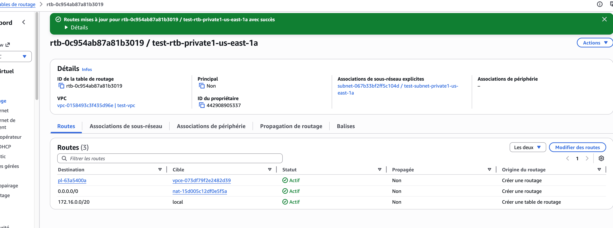

Je me forme en alternance à la cloud security avec pour objectif d'intégrer une grosse ESN dans les 6-12 prochains mois. Ce blog c'est mon journal de bord : pas des tutoriels lisses, mais ce que j'apprends vraiment, avec les galères incluses.

Après deux sessions théoriques sur le subnetting CIDR et l'architecture VPC, mon tuteur m'a envoyé sur la console AWS avec un seul brief : **déploie cette architecture toi-même, sans tutoriel**. Voici ce qui s'est passé.

## L'objectif du lab

Créer un VPC complet sur `172.16.0.0/20` avec une vraie segmentation réseau : des subnets publics exposés à internet, des subnets privés pour les serveurs applicatifs, et des subnets isolés pour les bases de données. Le tout réparti sur deux zones de disponibilité (AZs).

Avant de toucher à la console, j'ai posé mon architecture sur papier :



L'idée est simple : les subnets publics ont une route vers l'Internet Gateway (IGW), les subnets privés sortent sur internet via un NAT Gateway sans être exposés, et les subnets BDD sont complètement coupés d'internet.

```
VPC 172.16.0.0/20
│
├── AZ-A
│   ├── PUBLIC      172.16.1.0/28   → IGW
│   ├── PRIVÉ APPLI 172.16.1.32/27  → NAT Gateway
│   └── PRIVÉ BDD   172.16.1.64/26  → isolé
│
└── AZ-B
    ├── PUBLIC      172.16.2.0/28   → IGW
    └── PRIVÉ APPLI 172.16.2.32/27  → NAT Gateway
```

## VPC + subnets : ça démarre bien... puis ça coince

Créer le VPC c'est simple : tu donnes un bloc CIDR, tu valides. Mais la vraie difficulté arrive avec les subnets.

**Erreur n°1 : sortir du bloc parent.**
J'ai écrit `172.16.241.0` comme adresse de départ pour mon premier subnet. Sauf que le `/20` s'arrête à `172.16.15.255`. J'étais complètement en dehors du bloc. À retenir : avec un `/20`, le troisième octet va de **0 à 15 uniquement**.

**Erreur n°2 : le mauvais alignement.**
Un `/27` (32 adresses) doit commencer sur un multiple de 32 : `.0`, `.32`, `.64`... Pas `.17` ou `.50`. J'ai dû refaire mes calculs deux fois avant que ça soit bon.

Après correction, voici l'aperçu dans la console :



6 subnets, 2 AZs, 5 route tables. La structure est là. Mais une infra qui *a l'air* correcte dans l'aperçu n'est pas forcément bien routée. La vraie validation, c'est dans les route tables.

## Ce qui rend un subnet "public" : la route table

Voilà quelque chose que j'aurais pas compris sans pratiquer. Un subnet n'est pas "public" par nature : c'est sa route table qui fait la différence. Un subnet public, c'est juste un subnet avec une règle `0.0.0.0/0 → IGW`.

Une fois l'IGW créé et attaché au VPC, la route table publique ressemble à ça :



Deux règles : le trafic interne reste local (`172.16.0.0/20 → local`), tout le reste sort par l'IGW. Simple, et c'est ça qui expose les subnets publics à internet.

## La surprise : un VPC Endpoint S3

En inspectant les route tables privées, j'ai vu une entrée que je n'avais pas créée : `pl-63a5400a → vpce-073df79f2e2482d39`. J'ai d'abord cru que c'était une erreur.



En creusant, j'ai compris ce que c'était :



Un **VPC Endpoint S3** : un tunnel privé vers S3 qui évite que le trafic passe par internet. C'est en réalité une bonne pratique sécurité : les données qui transitent vers S3 depuis les subnets privés restent dans le réseau interne AWS. Je l'ai laissé en place.

## NAT Gateway : la partie qui coûte

Pour que les instances privées puissent sortir sur internet sans être accessibles depuis l'extérieur, il faut un NAT Gateway. Le principe : il traduit les IP privées en IP publique et mémorise les connexions sortantes, mais bloque tout ce qui tente de rentrer de l'extérieur.

Avant de le créer, il faut allouer une **Elastic IP** :



> ⚠️ Une Elastic IP non associée génère des frais, tout comme le NAT Gateway (~$0.045/heure). Pour un lab : tu crées, tu testes, tu supprimes immédiatement.

Et voilà l'erreur que j'ai faite en voulant aller trop vite :



J'avais tapé `nat-test` à la main dans le champ de la route table avant même d'avoir créé le NAT Gateway. AWS retourne `The natGateway ID 'nat-test' does not exist`. La leçon : toujours créer la ressource d'abord, attendre qu'elle soit disponible, *puis* la sélectionner dans le menu déroulant.

## Configuration finale des route tables

Une fois le NAT Gateway créé et disponible, j'ajoute la route dans les subnets applicatifs :



Et le résultat une fois sauvegardé :



Trois routes actives : le trafic local, l'accès S3 via l'endpoint privé, et la sortie internet via le NAT Gateway.

La route table de la BDD, elle, ne change pas : aucune route internet, subnet complètement isolé. Une base de données n'a aucune raison de communiquer avec internet. Si un attaquant compromet un autre composant de l'infra, il ne peut pas atteindre la BDD directement.

## Ce que ce lab m'a vraiment appris

Au-delà des commandes, voilà ce que j'ai compris en le faisant :

- **Un subnet n'est public que si sa route table pointe vers un IGW** : pas par défaut, pas par magie
- **Le subnetting sur papier c'est facile**, rester dans le bon bloc en pratique demande de l'attention
- **Le NAT Gateway doit être dans un subnet public** : sinon il ne peut pas atteindre l'IGW
- **Un VPC Endpoint c'est une bonne pratique**, pas un bug à corriger
- **Toujours nettoyer après un lab** : supprimer le NAT Gateway et libérer l'EIP pour éviter les frais

## En prod, personne ne fait ça à la main

Ce que j'ai fait en 45 minutes dans une console, un ingénieur cloud le fait en quelques lignes de Terraform, versionné dans Git, déployé automatiquement via un pipeline CI/CD. La console c'est pour comprendre. Terraform c'est pour le faire proprement.

```hcl
resource "aws_nat_gateway" "main" {
  allocation_id = aws_eip.nat.id
  subnet_id     = aws_subnet.public_a.id
  tags = { Name = "prod-nat-gateway" }
}

resource "aws_route" "private_nat" {
  route_table_id         = aws_route_table.private.id
  destination_cidr_block = "0.0.0.0/0"
  nat_gateway_id         = aws_nat_gateway.main.id
}
```

Je couvre Terraform dans quelques semaines : je ferai un article quand j'y serai.

*Prochain lab : Security Groups vs NACLs : comment filtrer le trafic à l'intérieur du VPC.*
